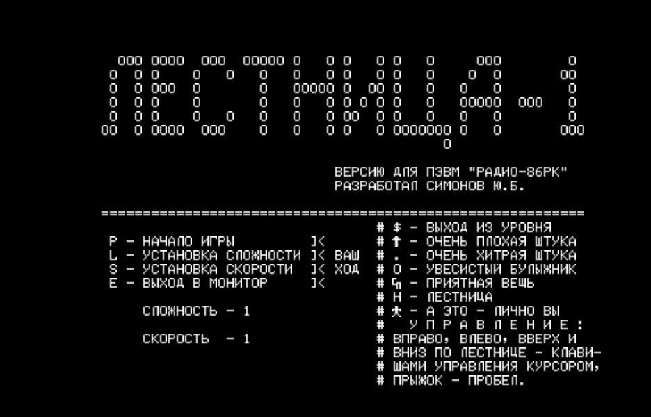
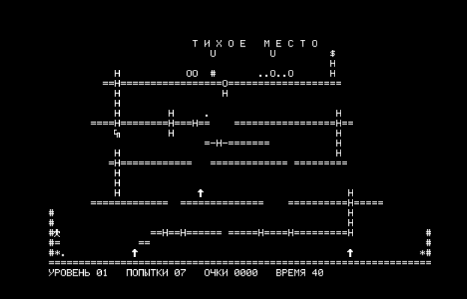

# Lestnica (Лестница) — Annotated Disassembly

An educational, byte-exact annotated disassembly of **Лестница** ("Ladder") — an
Intel 8080 game written in 1987 for the **Radio-86RK** (Радио-86РК) home
computer. The original game is credited on the title screen to **Симонов Ю.Б.**
(Simonov Yu.B.).

| Title / menu screen | In-game |
|---|---|
|  |  |

▶ **Play it online in an RK86 emulator**:
[rk86.ru/beta/?file=LESTNICA.GAM](https://rk86.ru/beta/index.html?file=LESTNICA.GAM)

## Purpose

This project exists purely for **historical preservation, study, and
education** — to understand how 8080 games of that era were structured, how
compilers of the time generated code, how RLE-compressed screen data was
laid out, how self-modifying code was used for difficulty settings, and how
the RK86 KOI-7 character set encoded both Russian text and block-drawing
graphics.

**The annotations, scripts, and documentation added here are the work of
contributors to this repository and are released under the MIT License
(see `LICENSE`).** The annotation layer is a derivative work of analysis;
it contains no new original game content.

**The underlying game binary `LESTNICA.GAM` (and its tape-format counterpart
`LESTNICA-TAPE.GAM`) is the original 1987 work of Симонов Ю.Б. and remains
the property of its original author(s). This repository does not claim any
rights to the original binary.** If you are the original author or rights
holder and wish to have the binary removed, please open an issue.

## Build & verify

The assembled output must match `LESTNICA.GAM` **byte-for-byte**.

```
just ci        # build + test (byte-identical round-trip)
just build     # assemble only
just test      # diff assembled binary against LESTNICA.GAM
just disasm    # regenerate lestnica.asm from LESTNICA.GAM (overwrites!)
```

Requirements: `bun` (for `bunx asm8080`), `just`, `python3`.

## Main artifacts

| file / dir | description |
|---|---|
| `LESTNICA.GAM` | original game binary (7712 bytes, org 0100h) — **unmodified original work** |
| `LESTNICA-TAPE.GAM` | tape-format copy (5-byte header + 3-byte trailer) — **unmodified original work** |
| [`lestnica.asm`](lestnica.asm) | annotated source (assembles byte-identical to `LESTNICA.GAM`) |
| [`lestnica.lst`](lestnica.lst) | assembler listing with addresses and symbol table |
| `lestnica.bin` | assembled output (generated; gitignored) |
| [`disasm.py`](disasm.py) | single-file Python Intel 8080 linear disassembler (used to seed `lestnica.asm`) |
| [`render_screen.py`](render_screen.py) | level / title-screen extractor — decodes RLE screen data into 78×30 ASCII-art text files |
| [`levels/title.txt`](levels/title.txt) | rendered title/menu screen |
| [`levels/level_A.txt`](levels/level_A.txt), [`B`](levels/level_B.txt), [`C`](levels/level_C.txt), [`D`](levels/level_D.txt), [`E`](levels/level_E.txt), [`F`](levels/level_F.txt), [`G`](levels/level_G.txt) | rendered playfields for the 7 unique levels |
| [`info/rk86-charmap.md`](info/rk86-charmap.md) | RK86 character-set reference (ASCII + Cyrillic + block glyphs) |
| `CLAUDE.md` | conventions, known game mechanics, and findings accumulated during analysis |
| `Justfile` | build recipes |

## Highlights of what's been decoded

- Full code structure: menu handler, `new_life` state reset, main tick loop, movement
  handlers, BCD score arithmetic, collision checks against known tile glyphs
- 32-bit LFSR PRNG at `prng_next` (seeded `5A 34 17 71`)
- RLE screen-data compression scheme and `paint_screen` decoder
- Level-pointer table structure (7 unique levels, 27 entries across 7 "rounds")
- Self-modifying code sites for difficulty and speed settings
- Complete tile glyph semantics from the in-game legend

See `CLAUDE.md` for the full catalog of findings.

## License

- Annotations, scripts, and documentation in this repository: **MIT License**
  (see `LICENSE`).
- `LESTNICA.GAM` and `LESTNICA-TAPE.GAM`: **© 1987 Симонов Ю.Б. (Simonov Yu.B.)**
  — all rights reserved by the original author. Included here solely for
  educational and preservation purposes.
